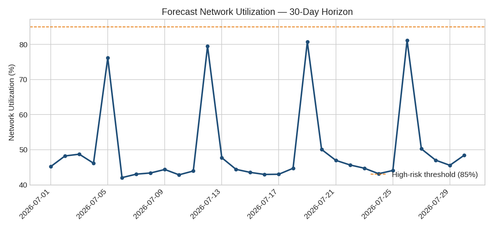
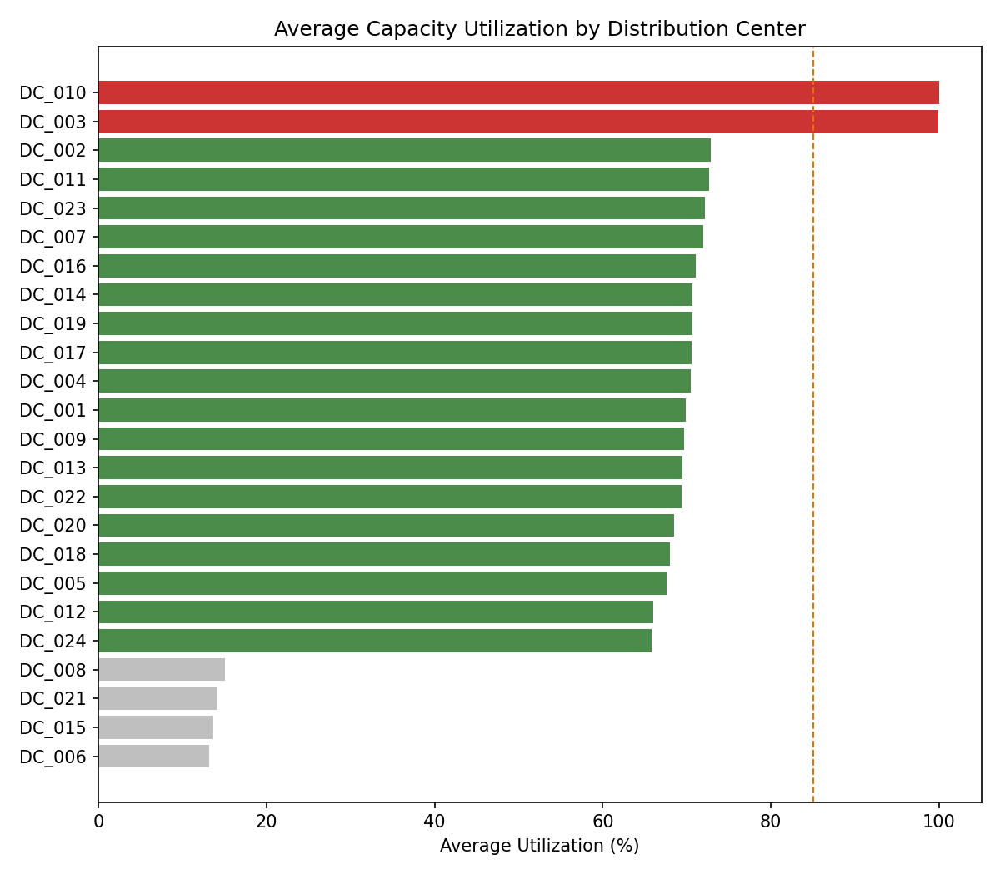

# 📦 DC Capacity Forecasting — A **Resource Planning** Engine for E-Commerce Fulfillment

**Turning a single top-line sales forecast into a day-by-day, distribution-center-by-distribution-center
operational plan — with capacity risk detection, staffing estimates, and what-if scenario simulation.**

[](https://www.python.org/)
[](https://pandas.pydata.org/)
[](LICENSE)

> 🧩 **Fictional case study.** `NovaCart` is a made-up online retailer created
> for this portfolio project. All data here is **synthetically generated**
> (`scripts/generate_sample_data.py`) to mirror the statistical patterns of a
> real last-mile fulfillment network — no proprietary or real company data is
> included. The original task brief this project answers is in
> [`docs/case_study.md`](docs/case_study.md).

---

## The problem

NovaCart's Commercial team forecasts *one* number every month: total items
expected to sell, network-wide. But Operations doesn't run on one number —
it runs on dozens of **Distribution Centers (DCs)**, each with multiple daily
**delivery time windows**, each with its own hard **capacity ceiling**.

Someone has to answer:

- How many items/orders will actually be delivered, **per DC, per day, per
  time window**?
- Which DCs are about to blow through capacity — and which have room to
  spare?
- How many staff shifts do we need, and where?
- What happens on the days some DCs are closed — does that demand just
  disappear?
- If we expand capacity at our worst bottleneck, is it worth it?

This project builds an end-to-end pipeline that answers all of the above,
validates itself against history, and exports a single, planning-team-ready
Excel workbook.

## Why this isn't "just another forecasting model"

Most forecasting tutorials stop at predicting a number. This project treats
forecasting as one step in an **operational planning problem**:

- **Dynamic Spatial Share allocation** — demand is split across DCs and time
  windows using a share that's recency-weighted, so recent shifts in network
  behavior are picked up faster than a flat historical average would.
- **Closed-day demand rollforward** — some DCs aren't open every day. Instead
  of vanishing, unmet demand on a closed day cascades forward to the next
  open day, which is exactly what drives the periodic spikes you'll see in
  the utilization chart below.
- **Capacity-aware backtesting** — accuracy is evaluated at *two* levels
  (raw demand accuracy vs. capacity-constrained accuracy), because capping
  a bad forecast at capacity can otherwise hide real model error.
- **Decision-ready output** — not just numbers, but risk categories, staffing
  requirements, and a what-if scenario with a cost/benefit readout.

## Architecture

```
Historical Delivery Data ─┐
Sales Forecast ───────────┼──▶ Feature Extraction ──▶ Weekday Pattern Learning
Order Cycle Time ─────────┘                                    │
                                                                 ▼
                                          Dynamic Spatial Share Allocation
                                                                 │
                                        Closed-Day Demand Rollforward
                                                                 │
                                             Capacity Capping (CAP)
                                                                 │
                                                    Forecast Generation
                                    ┌───────────────────────────┼──────────────────────────┐
                                    ▼                            ▼                          ▼
                     Backtesting & Validation      Capacity & Risk Analysis     What-If Scenario Analysis
                        (MAE/RMSE/WAPE/MAPE)        (at-risk / surplus DCs)      (capacity expansion + $)
                                    └───────────────────────────┬──────────────────────────┘
                                                                 ▼
                                                 📊 Excel Workbook (11 sheets)
```

Full step-by-step logic: [`docs/methodology.md`](docs/methodology.md).

## Sample results (from the synthetic dataset in this repo)

Running the pipeline on the bundled 24-DC / 91-day synthetic dataset
produces a 30-day forecast with:

| KPI | Value |
|---|---|
| DCs analyzed | 24 |
| Forecast horizon | 30 days |
| Network utilization | ~48% |
| Estimated staff shifts needed | ~18,800 |
| DCs at structural risk | 2 |
| DCs with surplus capacity | 4 |
| WAPE (capacity-constrained, items) | ~12% |

**Network utilization over the forecast horizon** — the recurring spikes are
demand rolling forward from DCs that close one day a week:



**Utilization spread across DCs** — a handful of chronic bottlenecks (red)
and surplus DCs (grey) sit at either end of a mostly healthy network:



A full sample output workbook is included at
[`outputs/DC_Capacity_Forecast.xlsx`](outputs/DC_Capacity_Forecast.xlsx) —
11 sheets covering the forecast, network/DC summaries, at-risk & surplus DC
lists, backtest metrics, a what-if scenario, methodology, and a one-page
management summary.

## Project structure

```
dc-capacity-forecasting/
├── data/sample/                  # synthetic input data (generated, not real)
├── docs/
│   ├── case_study.md             # the original task brief
│   ├── methodology.md            # full methodology write-up
│   └── images/                   # charts used in this README
├── outputs/                      # generated Excel workbook lands here
├── scripts/
│   └── generate_sample_data.py   # synthetic data generator
├── src/
│   ├── config.py                 # all tunable parameters live here
│   ├── date_utils.py
│   ├── data_loader.py
│   ├── forecasting.py            # core allocation model
│   ├── backtesting.py            # leave-one-day-out validation
│   ├── capacity_analysis.py      # risk/surplus classification
│   ├── scenario_analysis.py      # what-if capacity expansion + cost/benefit
│   ├── report_export.py          # styled multi-sheet Excel export
│   └── main.py                   # orchestrates the full pipeline
├── requirements.txt
└── README.md
```

## Getting started

```bash
git clone https://github.com/<your-username>/dc-capacity-forecasting.git
cd dc-capacity-forecasting
pip install -r requirements.txt

# 1. Generate the synthetic input dataset
python scripts/generate_sample_data.py

# 2. Run the full pipeline (forecast -> backtest -> capacity analysis -> Excel export)
python -m src.main
```

Output lands in `outputs/DC_Capacity_Forecast.xlsx`. Tune the forecast
horizon, staffing ratio, or risk thresholds in `src/config.py` — everything
else in the pipeline reads from there.

### Using your own data

Point `src/config.py` at your own CSVs as long as they follow the same
schema as the files in `data/sample/` (see
[`docs/methodology.md`](docs/methodology.md#2-how-the-source-data-is-used)
for the exact column expectations).

## Tech stack

- **Python** (pandas, NumPy) for the modeling pipeline
- **openpyxl** for the styled, stakeholder-ready Excel export
- **matplotlib** (optional) for the charts in this README

## Limitations & future work

This is a business-logic allocation model, not a demand-generating
time-series model — it deliberately trades some sophistication for
transparency and auditability, which matters in an operations-planning
context. Known limitations and ideas for extending it (native sales
forecasting, multi-scenario optimization, external-factor integration, a BI
dashboard) are documented in
[`docs/methodology.md#8-future-development-ideas`](docs/methodology.md#8-future-development-ideas).

## About

Built as a portfolio project to demonstrate **Resource Planning**, capacity
forecasting-model design, validation methodology, and stakeholder-ready
reporting for an operations/supply-chain analytics role.

Licensed under the [MIT License](LICENSE).
