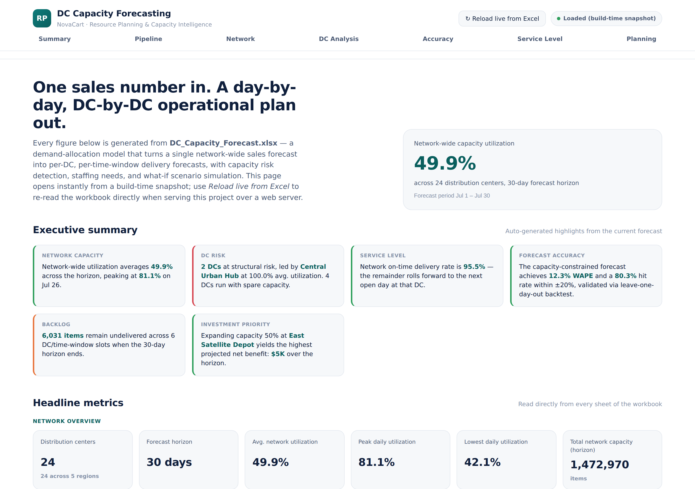
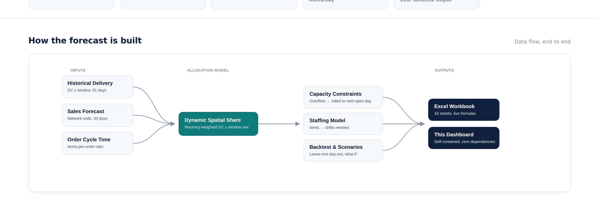
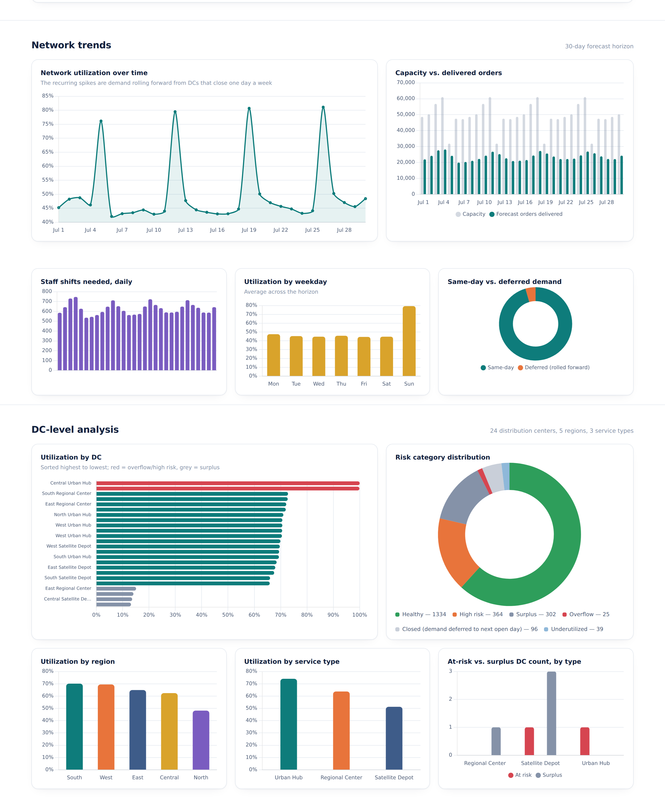
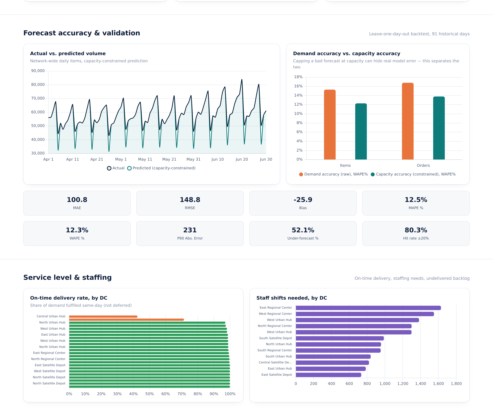
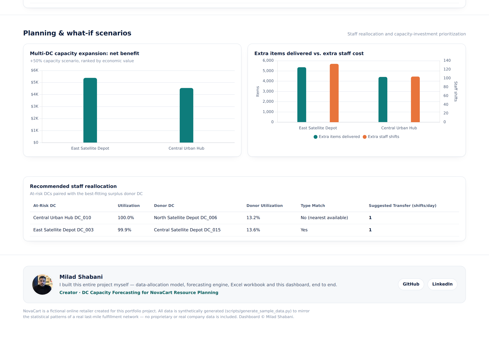

# 📦 DC Capacity Forecasting — A **Resource Planning** Engine for E-Commerce Fulfillment

**Turning a single top-line sales forecast into a day-by-day, distribution-center-by-distribution-center
operational plan — with capacity risk detection, staffing estimates, and what-if scenario simulation.**

[](https://www.python.org/)
[](https://pandas.pydata.org/)
[](LICENSE)

> 🧩 **Fictional case study.** `NovaCart` is a made-up online retailer created
> for this portfolio project. All data here is **synthetically generated**
> (`scripts/generate_sample_data.py`) to mirror the statistical patterns of a
> real last-mile fulfillment network — no proprietary or real company data is
> included. The original task brief this project answers is in
> [`docs/case_study.md`](docs/case_study.md).

---

## Live dashboard

`dashboard/index.html` is a **single, self-contained HTML file** — no server, no framework, no npm install, no CORS issues. `scripts_dashboard/export_dashboard_data.py` bakes the finished workbook's data directly into that file at build time (along with the Chart.js and SheetJS libraries themselves), so opening it always works, even with zero internet access. An optional **"↻ Reload live from Excel"** button re-parses `outputs/DC_Capacity_Forecast.xlsx` directly in the browser when the project is served over http/https.

<p align="center">
  <br>
  <em>Executive summary and 21 headline KPIs across network overview, demand &amp; fulfillment, staffing &amp; capacity risk, and forecast accuracy.</em>
</p>

<p align="center">
  <br>
  <em>How the forecast is built — inputs, the Dynamic Spatial Share allocation model, and outputs, in one diagram.</em>
</p>

<p align="center">
  <br>
  <em>Network utilization trend, staffing, weekday seasonality, and DC-level risk/region/service-type breakdowns.</em>
</p>

<p align="center">
  <br>
  <em>Actual-vs-predicted backtest trend, 8 accuracy metrics, on-time delivery rate by DC, and staffing needs by DC.</em>
</p>

<p align="center">
  <br>
  <em>Multi-DC capacity-expansion ranking, cost/benefit tradeoffs, and the recommended staff reallocation plan.</em>
</p>

**Open it:** double-click `dashboard/index.html` — no setup required. To use the live-reload button instead, run `python -m http.server 8000` from the project root and open `http://localhost:8000/dashboard/`.

---

## What's new since the original model

On top of the original allocation/forecasting/backtesting engine, this build adds four new analyses (`src/advanced_analysis.py`) that surface decision-ready value that was already latent in the data but not previously reported on its own:

- **On-Time Delivery Rate** — the forecast already split delivered volume into same-day vs. deferred-from-a-closed-day at the row level; this rolls it up into a proper network- and DC-level service-level KPI (95.5% network-wide in the sample data).
- **Staff Reallocation Plan** — greedily pairs each at-risk DC with the best-fitting surplus donor DC (same service type preferred) and recommends a specific, conservative shift-transfer size.
- **Backtest Daily Trend** — the day-by-day actual-vs-predicted series the aggregate backtest metrics were computed from, now available to chart directly.
- **Multi-DC What-If Comparison** — re-runs the capacity-expansion scenario for the top at-risk DCs and ranks them by net economic benefit, turning one scenario into a prioritized investment shortlist.

The Excel workbook grew from 11 to **16 sheets** to carry these (plus a new Region Summary rollup); the dashboard is entirely new.

---

## The problem

NovaCart's Commercial team forecasts *one* number every month: total items
expected to sell, network-wide. But Operations doesn't run on one number —
it runs on dozens of **Distribution Centers (DCs)**, each with multiple daily
**delivery time windows**, each with its own hard **capacity ceiling**.

Someone has to answer:

- How many items/orders will actually be delivered, **per DC, per day, per
  time window**?
- Which DCs are about to blow through capacity — and which have room to
  spare?
- How many staff shifts do we need, and where?
- What happens on the days some DCs are closed — does that demand just
  disappear?
- If we expand capacity at our worst bottleneck, is it worth it?

This project builds an end-to-end pipeline that answers all of the above,
validates itself against history, and exports a single, planning-team-ready
Excel workbook.

## Why this isn't "just another forecasting model"

Most forecasting tutorials stop at predicting a number. This project treats
forecasting as one step in an **operational planning problem**:

- **Dynamic Spatial Share allocation** — demand is split across DCs and time
  windows using a share that's recency-weighted, so recent shifts in network
  behavior are picked up faster than a flat historical average would.
- **Closed-day demand rollforward** — some DCs aren't open every day. Instead
  of vanishing, unmet demand on a closed day cascades forward to the next
  open day, which is exactly what drives the periodic spikes you'll see in
  the utilization chart below.
- **Capacity-aware backtesting** — accuracy is evaluated at *two* levels
  (raw demand accuracy vs. capacity-constrained accuracy), because capping
  a bad forecast at capacity can otherwise hide real model error.
- **Decision-ready output** — not just numbers, but risk categories, staffing
  requirements, and a what-if scenario with a cost/benefit readout.

## Architecture

```
Historical Delivery Data ─┐
Sales Forecast ───────────┼──▶ Feature Extraction ──▶ Weekday Pattern Learning
Order Cycle Time ─────────┘                                    │
                                                                 ▼
                                          Dynamic Spatial Share Allocation
                                                                 │
                                        Closed-Day Demand Rollforward
                                                                 │
                                             Capacity Capping (CAP)
                                                                 │
                                                    Forecast Generation
                                    ┌───────────────────────────┼──────────────────────────┐
                                    ▼                            ▼                          ▼
                     Backtesting & Validation      Capacity & Risk Analysis     What-If Scenario Analysis
                        (MAE/RMSE/WAPE/MAPE)        (at-risk / surplus DCs)      (capacity expansion + $)
                                    └───────────────────────────┬──────────────────────────┘
                                                                 ▼
                                                 📊 Excel Workbook (16 sheets)
                                                                 │
                                                     🖥️  Interactive Dashboard
```

Full step-by-step logic: [`docs/methodology.md`](docs/methodology.md).

## Sample results (from the synthetic dataset in this repo)

Running the pipeline on the bundled 24-DC / 91-day synthetic dataset
produces a 30-day forecast with:

| KPI | Value |
|---|---|
| DCs analyzed | 24 |
| Forecast horizon | 30 days |
| Network utilization | ~48% |
| Estimated staff shifts needed | ~18,800 |
| DCs at structural risk | 2 |
| DCs with surplus capacity | 4 |
| WAPE (capacity-constrained, items) | ~12% |
| Network on-time delivery rate | ~95.5% |
| Undelivered backlog at horizon end | ~6,000 items |

**Network utilization over the forecast horizon** — the recurring spikes are
demand rolling forward from DCs that close one day a week:


**Utilization spread across DCs** — a handful of chronic bottlenecks (red)
and surplus DCs (grey) sit at either end of a mostly healthy network:


A full sample output workbook is included at
[`outputs/DC_Capacity_Forecast.xlsx`](outputs/DC_Capacity_Forecast.xlsx) —
16 sheets covering the forecast, network/DC/region summaries, at-risk & surplus DC
lists, on-time delivery rate, staff reallocation plan, backtest metrics and daily
trend, single- and multi-DC what-if scenarios, methodology, and a one-page
management summary. See [Live dashboard](#live-dashboard) above for the same
data rendered interactively.

## Project structure

```
dc-capacity-forecasting/
├── data/sample/                  # synthetic input data (generated, not real)
├── docs/
│   ├── case_study.md             # the original task brief
│   ├── methodology.md            # full methodology write-up
│   └── images/                   # charts and dashboard screenshots used in this README
├── outputs/                      # generated Excel workbook lands here
├── dashboard/
│   ├── index.html                # the dashboard -- fully self-contained, data embedded at build time
│   └── assets/
│       └── milad-shabani.jpg     # creator photo shown in the dashboard footer
├── scripts/
│   └── generate_sample_data.py   # synthetic data generator
├── scripts_dashboard/
│   ├── export_dashboard_data.py  # embeds workbook data + Chart.js/SheetJS into dashboard/index.html
│   ├── build_all.py              # runs the full pipeline (model + dashboard embed) in one command
│   └── vendor/                   # vendored Chart.js + SheetJS (for fully offline builds)
├── src/
│   ├── config.py                 # all tunable parameters live here
│   ├── date_utils.py
│   ├── data_loader.py
│   ├── forecasting.py            # core allocation model
│   ├── backtesting.py            # leave-one-day-out validation
│   ├── capacity_analysis.py      # risk/surplus classification
│   ├── scenario_analysis.py      # what-if capacity expansion + cost/benefit
│   ├── advanced_analysis.py      # on-time rate, staff reallocation, backtest trend, multi-DC scenario
│   ├── report_export.py          # styled multi-sheet Excel export
│   └── main.py                   # orchestrates the full pipeline
├── publish_to_github.sh          # push local changes to this repo (macOS/Linux)
├── publish.bat                   # one-click equivalent for Windows (requires git + GitHub CLI)
├── requirements.txt
└── README.md
```

## Getting started

```bash
git clone https://github.com/Milad-Shabani/Resource-planning-capacity-forecasting.git
cd Resource-planning-capacity-forecasting
pip install -r requirements.txt

# 1. Generate the synthetic input dataset
python scripts/generate_sample_data.py

# 2. Run the full pipeline AND embed the results into the dashboard, in one command
python scripts_dashboard/build_all.py

# (equivalent to running `python -m src.main` followed by
#  `python scripts_dashboard/export_dashboard_data.py` separately)
```

Output lands in `outputs/DC_Capacity_Forecast.xlsx`, and `dashboard/index.html`
is updated to match. Tune the forecast horizon, staffing ratio, or risk
thresholds in `src/config.py` — everything else in the pipeline reads from there.

### Using your own data

Point `src/config.py` at your own CSVs as long as they follow the same
schema as the files in `data/sample/` (see
[`docs/methodology.md`](docs/methodology.md#2-how-the-source-data-is-used)
for the exact column expectations).

## Tech stack

- **Python** (pandas, NumPy) for the modeling pipeline
- **openpyxl** for the styled, stakeholder-ready Excel export
- **matplotlib** (optional) for the static charts in this README
- **Chart.js** and **SheetJS**, vendored and inlined, for the fully offline interactive dashboard

## Publishing changes to this repo

**macOS / Linux:**
```bash
chmod +x publish_to_github.sh
./publish_to_github.sh
```

**Windows** (requires [git](https://git-scm.com/) and the [GitHub CLI](https://cli.github.com/), authenticated via `gh auth login`):
```bat
publish.bat
```

Both scripts commit and push to this repo's existing `origin` remote and leave GitHub Pages configured to serve `dashboard/index.html` via GitHub Actions -- see **Settings → Pages → Source → GitHub Actions** if it isn't already set that way.

## Limitations & future work

This is a business-logic allocation model, not a demand-generating
time-series model — it deliberately trades some sophistication for
transparency and auditability, which matters in an operations-planning
context. Known limitations and ideas for extending it further (native sales
forecasting, true multi-scenario optimization across many levers at once,
external-factor integration) are documented in
[`docs/methodology.md#8-future-development-ideas`](docs/methodology.md#8-future-development-ideas).

## About

Built as a portfolio project to demonstrate **Resource Planning**, capacity
forecasting-model design, validation methodology, and stakeholder-ready
reporting for an operations/supply-chain analytics role.

Licensed under the [MIT License](LICENSE).
